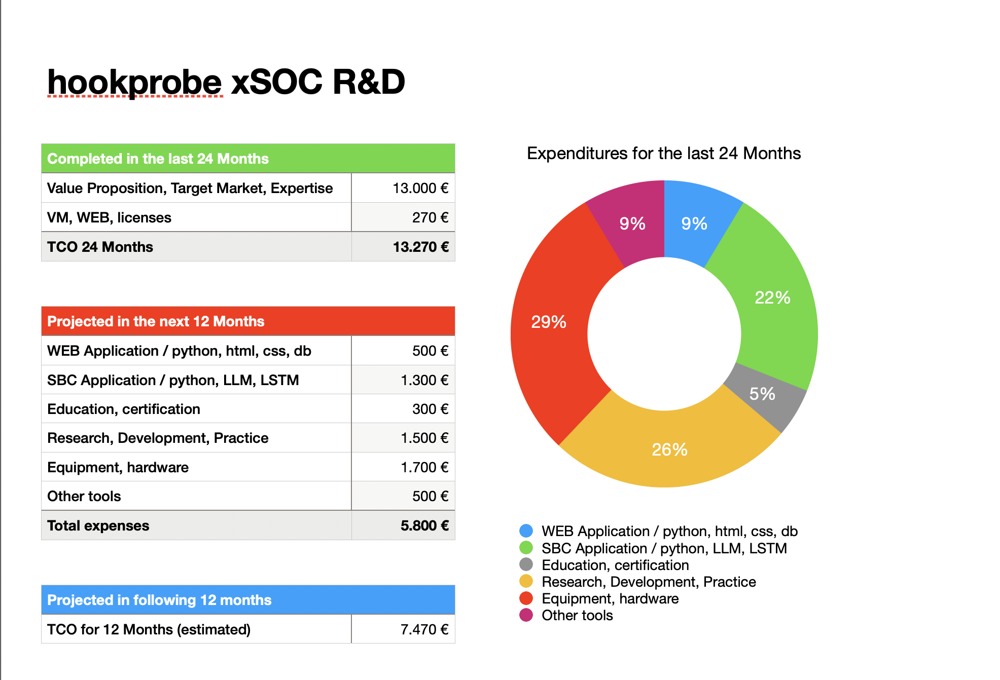

# hookprobe


**"Single Board Computers (SBCs) and Security Operations Centers (SOCs): Leading the Charge in the Cybersecurity Battle"**

## 🎯 Overview

HookProbe is a comprehensive cybersecurity platform built on Single Board Computers (SBCs), providing enterprise-grade security capabilities for individuals, small businesses, and home networks. The platform combines cutting-edge AI-driven threat detection with automated response systems, making advanced cybersecurity accessible and affordable.

### Key Features

- **🤖 AI-Powered Threat Detection**: Qsecbit algorithm for real-time security analysis
- **🛡️ Automated Response**: Kali Linux on-demand threat mitigation
- **📊 Complete Monitoring**: Grafana + Prometheus + Loki + VictoriaMetrics
- **🔒 Zero Trust Architecture**: PSK-encrypted VXLAN, OpenFlow ACLs, L2 hardening
- **🌐 Web Application Firewall**: NAXSI/ModSecurity with auto-updating rules
- **☁️ Optional Cloud Integration**: Cloudflare Tunnel for secure remote access
- **🔄 Workflow Automation**: Optional n8n integration for content generation

---

## 📖 Table of Contents

- [Background Story](#background-story)
- [Architecture](#architecture)
- [Getting Started](#getting-started)
- [Optional Features](#optional-features)
  - [n8n Workflow Automation](#n8n-workflow-automation-pod-008)
  - [LTE/5G Connectivity](#lte5g-connectivity)
- [Security Features](#security-features)
- [Monitoring & Analytics](#monitoring--analytics)
- [Documentation](#documentation)
- [Contributing](#contributing)
- [License](#license)

---

## 🌆 Background Story

In the year 2035, the digital landscape had evolved into a complex, interconnected web where threats lurked around every corner. Cyberattacks were no longer the domain of isolated hackers; they had become sophisticated operations executed by highly organized groups. Governments, corporations, and individuals alike were under constant siege from these digital marauders, who exploited every vulnerability to steal data, disrupt services, and wreak havoc.

In this climate of omnipresent danger, traditional security measures proved insufficient. Firewalls and antivirus software, once the mainstay of cybersecurity, could no longer keep pace with the rapid evolution of threats. The need for real-time detection and response had become paramount, and this necessity gave rise to an innovative solution: the integration of edge technology with Security Operations Centers (SOCs).

Edge technology, characterized by the use of decentralized computing resources at the "edge" of the network, offered a way to process data closer to its source, reducing latency and enabling real-time decision-making. This approach became the backbone of modern security infrastructure. Central to this transformation were single-board computers (SBCs) like Nvidia Jetson, Raspberry Pi and Banana Pi (Arm64 based SoCs) which empowered individuals to take an active role in their own digital defense.

In this new era, homes and small businesses deployed SBCs as personal security nodes. Equipped with advanced sensors and AI-driven software, these compact devices continuously monitored network traffic, identifying anomalies and potential threats with unprecedented speed and accuracy. The data collected by these SBCs was then relayed to a decentralized network of SOCs, where it was aggregated and analyzed in real-time.

Each SOC was a hub of activity, staffed by a new breed of cybersecurity analysts who used advanced tools to correlate data from thousands of edge devices. Machine learning algorithms sifted through the information, detecting patterns that indicated malicious activity. When a threat was identified, the SOC could issue immediate countermeasures, deploying patches, isolating infected devices, and even launching counter-hacks to neutralize the attackers.

In the heart of Bucharest, one such SOC was operated by a team of experts led by Andrei Toma, a former interior architect turned cybersecurity strategist. His command center was a high-tech fortress, filled with screens displaying live feeds from edge devices across the city. Andrei's team worked in shifts, ensuring 24/7 vigilance.

One evening, as HookProbe intelligence monitored the incoming data, a spike in traffic from a cluster of residential SBCs caught the intelligence eye. The pattern suggested a coordinated attack targeting smart home devices. With a few swift commands, iEYE directed the SOC's AI to analyze the data more closely. Within seconds, it identified the source: a botnet attempting root shell access in home security cameras and smart locks.

HookProbe activated the local SOC's response protocol. Alerts were sent to the affected households, activating DDoS protection by cutting down the connection, instructing residents that traffic was going to the back-up connection. Simultaneously, the SOC's AI deployed patches to seal the exploited vulnerabilities. For those already compromised, HookProbe's team used edge technology to isolate the infected devices from the rest of the network, preventing the spread of the attack.

Thanks to the decentralized nature of the edge network, the response was swift and efficient. The botnet was neutralized before it could cause significant damage, and the residents' digital lives were safeguarded.

As the crisis abated, HookProbe Team reflected on the power of this new paradigm. In a world where threats were everywhere, the combination of edge technology and SOCs provided a robust defense. Single-board computers like Nvidia Jetson, Raspberry Pi and Banana Pi had democratized cybersecurity, turning ordinary people into vigilant guardians of their digital realms. Through this collaborative effort, the digital world had become a safer place, where threats could be met and defeated in real time.

And so, in the face of ever-evolving dangers, humanity adapted and thrived, using the very technology that once made them vulnerable to create a resilient and secure digital future.

---

## 🏗️ Architecture

HookProbe v5.0 implements a **7-POD architecture** with optional 8th POD for automation:

### Core PODs (001-007)

| POD | Network | Purpose | Key Components |
|-----|---------|---------|----------------|
| **001** | 10.101.0.0/24 | Web DMZ | Django CMS, NAXSI WAF, Nginx, Cloudflare Tunnel |
| **002** | 10.102.0.0/24 | IAM/Auth | Logto, Keycloak, LDAP |
| **003** | 10.103.0.0/24 | Persistent DB | PostgreSQL, NFS, RADIUS |
| **004** | 10.104.0.0/24 | Transient DB | Redis |
| **005** | 10.105.0.0/24 | Monitoring | Grafana, Prometheus, Loki, VictoriaMetrics, Rsyslog |
| **006** | 10.106.0.0/24 | Security | Suricata, Zeek, Snort 3, ModSecurity |
| **007** | 10.107.0.0/24 | AI Response | Qsecbit Analysis, Kali Linux (on-demand) |

### Optional POD (008)

| POD | Network | Purpose | Key Components |
|-----|---------|---------|----------------|
| **008** | 10.108.0.0/24 | Automation | n8n, PostgreSQL, Redis, Chromium, MCP Server |

### Network Topology

```
┌─────────────────────────────────────────────────────────────┐
│                    Internet / WAN                           │
└──────────────────┬──────────────────────────────────────────┘
                   │
         ┌─────────▼─────────┐
         │  Physical Host    │
         │  (Intel N100)     │
         │  OVS Bridge       │
         └─────────┬─────────┘
                   │
    ┌──────────────┴──────────────┐
    │   PSK-Encrypted VXLAN       │
    │   (VNI 100-108)             │
    └──────────────┬──────────────┘
                   │
    ┏━━━━━━━━━━━━━┻━━━━━━━━━━━━━┓
    ┃    POD Network Isolation   ┃
    ┃    OpenFlow ACLs           ┃
    ┃    L2 Anti-Spoof           ┃
    ┗━━━━━━━━━━━━━┳━━━━━━━━━━━━━┛
                   │
    ┌──────────────┼──────────────┐
    │              │              │
┌───▼───┐     ┌───▼───┐     ┌───▼───┐
│POD 001│     │POD 002│ ... │POD 007│
│  DMZ  │     │  IAM  │     │  AI   │
└───────┘     └───────┘     └───────┘
                   │
              ┌────▼────┐
              │ POD 008 │ (Optional)
              │Automation│
              └─────────┘
```

---

## 🚀 Getting Started

### Prerequisites

**Hardware Requirements:**
- **CPU**: Intel N100 or equivalent x86_64 (4+ cores)
- **RAM**: 16GB minimum (32GB recommended)
- **Storage**: 500GB SSD minimum (1TB recommended)
- **Network**: 1Gbps NIC

**Software Requirements:**
- **OS**: RHEL 10, Fedora 38+, or CentOS Stream 9
- **Root Access**: Required for installation
- **Internet**: Required for downloading container images

### Quick Installation

1. **Download Installation Scripts**

```bash
git clone https://github.com/hookprobe/hookprobe.git
cd hookprobe/Scripts/autonomous/install/
```

2. **Configure Network Settings**

```bash
nano network-config.sh
```

**Critical settings to change:**
```bash
HOST_A_IP="192.168.1.100"              # Your server IP
PHYSICAL_HOST_INTERFACE="eth0"         # Your NIC
INTERNET_GATEWAY="192.168.1.1"         # Your gateway

# Change all PSK keys (generate with: openssl rand -base64 32)
OVS_PSK_MAIN="..."
OVS_PSK_DMZ="..."
OVS_PSK_INTERNAL="..."

# Database passwords
POSTGRES_PASSWORD="..."
LOGTO_DB_PASSWORD="..."

# Django secret key
DJANGO_SECRET_KEY="..."
```

3. **Deploy HookProbe**

```bash
chmod +x setup.sh
sudo ./setup.sh
```

Installation takes **15-20 minutes**.

4. **Access Services**

- **Django Admin**: http://YOUR_IP/admin (admin/admin)
- **Grafana**: http://YOUR_IP:3000 (admin/admin)
- **Logto Admin**: http://YOUR_IP:3002
- **Qsecbit API**: http://YOUR_IP:8888

⚠️ **IMPORTANT**: Change all default passwords immediately!

---

## 🔧 Optional Features

### n8n Workflow Automation (POD 008)

**Status**: Optional Extension

The n8n integration adds autonomous workflow automation capabilities to HookProbe, enabling:

- **Automated Content Generation**: AI-powered blog posts and security alerts
- **Web Scraping & Analysis**: Automated threat intelligence gathering
- **Security Workflow Automation**: Auto-publish Qsecbit alerts
- **Social Media Integration**: Cross-posting to multiple platforms
- **MCP Server**: AI content generation API with OpenAI/Anthropic support

#### Quick Start: n8n Integration

**Prerequisites:**
- Main HookProbe (PODs 001-007) must be deployed first
- Additional 4GB RAM recommended
- Ports 5678 (n8n) and 8889 (MCP) available

**Installation:**

```bash
cd hookprobe/Scripts/autonomous/install/

# Configure n8n
nano n8n_network-config.sh
# Change: N8N_BASIC_AUTH_PASSWORD, N8N_DB_POSTGRESDB_PASSWORD
# Optional: OPENAI_API_KEY, ANTHROPIC_API_KEY

# Deploy POD 008
chmod +x n8n_setup.sh
sudo ./n8n_setup.sh
```

**Access:**
- **n8n UI**: http://YOUR_IP:5678
- **MCP API**: http://YOUR_IP:8889

**Documentation**: See [N8N_README.md](../main/n8n/README.md) for complete guide

#### n8n Use Cases

1. **Autonomous Blogging**
   - Daily CVE monitoring → AI content generation → Auto-publish to Django CMS
   - Cross-post to LinkedIn, Twitter, Mastodon

2. **Security Automation**
   - Qsecbit RED alert → Generate incident report → Publish alert → Email team

3. **Threat Intelligence**
   - Monitor RSS feeds → Scrape articles → Analyze with AI → Create summaries

4. **Social Media Management**
   - New blog post → Generate captions → Cross-post to all platforms → Track engagement

**Starter Workflows Included:**
- `daily-blog-post.json` - Automated content generation
- `qsecbit-monitor.json` - Security threat monitoring

---

### LTE/5G Connectivity

**Status**: Optional Feature

Add cellular connectivity for failover, remote deployment, or primary internet access.

#### Supported Hardware

**Recommended Modems:**
- **Quectel RM520N-GL** (5G Sub-6 GHz, M.2 form factor)
- **Quectel RM502Q-AE** (5G, M.2 form factor)
- **Sierra Wireless EM9191** (5G, M.2 form factor)
- **Quectel EC25** (4G LTE Cat 4, mini PCIe)
- **Huawei ME909s-120** (4G LTE Cat 4, mini PCIe)

**Compatible SBCs with M.2 Slots:**
- Raspberry Pi 5 + M.2 HAT
- Banana Pi BPI-R3 (built-in M.2)
- Radxa ROCK 5B (M.2 E-Key slot)
- Orange Pi 5 Plus (M.2 M-Key slot)

#### Quick Setup

1. **Install Modem Hardware**

```bash
# For M.2 modems on Raspberry Pi 5
# Attach modem to M.2 HAT
# Connect antennas to modem

# For built-in M.2 (BPI-R3, ROCK 5B)
# Insert modem into M.2 slot
# Connect antennas
```

2. **Install Software**

```bash
# Install ModemManager and NetworkManager
sudo dnf install ModemManager NetworkManager

# Enable services
sudo systemctl enable --now ModemManager
sudo systemctl enable --now NetworkManager

# Verify modem detection
mmcli -L
```

3. **Configure Connection**

```bash
# Create connection profile
sudo nmcli connection add \
    type gsm \
    ifname '*' \
    con-name lte-wan \
    apn your.apn.here \
    connection.autoconnect yes

# Activate connection
sudo nmcli connection up lte-wan

# Check status
mmcli -m 0
```

4. **Configure Failover**

Edit `network-config.sh`:
```bash
# Primary WAN
PHYSICAL_HOST_INTERFACE="eth0"

# LTE Failover
LTE_INTERFACE="wwan0"
LTE_PRIORITY="100"  # Lower = higher priority

# Enable automatic failover
ENABLE_WAN_FAILOVER="true"
```

5. **Monitor Connection**

```bash
# Real-time modem status
watch -n 2 'mmcli -m 0 | grep -E "state|signal quality|operator"'

# Network metrics
nmcli device show wwan0

# Add to Grafana
# Metrics automatically exported via node_exporter
```

#### LTE Features

- **Automatic Failover**: Switch to LTE when primary WAN fails
- **Load Balancing**: Distribute traffic across WAN and LTE
- **VPN over LTE**: Full VPN support (WireGuard/OpenVPN)
- **Metrics Collection**: Signal strength, data usage, connection state
- **Grafana Dashboards**: Real-time monitoring of cellular connectivity

**Data Plans:**
- Recommended: Unlimited or >100GB/month for primary use
- Failover: 10-20GB/month typically sufficient

**Documentation**: See [LTE/README.md](../main/LTE/README.md) for detailed setup

---

## 🔒 Security Features

### Six-Layer Defense System

```
Layer 1: Kernel-Level (XDP/eBPF)
  ├─ DDoS mitigation at NIC level
  └─ Packet filtering before kernel stack

Layer 2: Network (OVS + VXLAN)
  ├─ PSK-encrypted tunnels
  ├─ OpenFlow anti-spoof ACLs
  └─ ARP/ND protection

Layer 3: Firewall (nftables)
  ├─ Default deny forwarding
  ├─ Per-service allowlist
  └─ Connection tracking + rate limiting

Layer 4: Application (WAF)
  ├─ NAXSI/ModSecurity
  ├─ XSS/SQL injection blocking
  └─ Auto-updating rulesets

Layer 5: Detection (IDS/IPS)
  ├─ Suricata + Zeek + Snort 3
  ├─ Signature-based detection
  └─ Behavioral analysis

Layer 6: AI Response (Qsecbit + Kali)
  ├─ Real-time threat scoring (RAG: Red/Amber/Green)
  ├─ Automated countermeasures
  └─ On-demand Kali Linux for mitigation
```

### Qsecbit AI Threat Analysis

**Quantum Security Bit (Qsecbit)** - A resilience metric measuring the smallest unit where AI-driven attack and defense reach equilibrium.

**Components:**
- **System Drift** (30%): Mahalanobis distance from baseline telemetry
- **Attack Probability** (30%): ML-predicted threat level
- **Classifier Decay** (20%): Rate of change in ML confidence
- **Quantum Drift** (20%): System entropy deviation

**Thresholds:**
- **GREEN** (< 0.45): Normal operation
- **AMBER** (0.45-0.70): Warning - Kali Linux spins up
- **RED** (> 0.70): Critical - Automated response engaged

**Automated Response Actions:**

| Threat Type | Actions |
|-------------|---------|
| XSS Injection | Update WAF rules, Block IP, Scan attacker, Generate report |
| SQL Injection | DB snapshot, Update WAF, Block IP, Enable logging, Integrity check |
| Memory Overflow | Capture diagnostics, Reduce limits, Clear caches, Safe restart |

### Network Hardening Controls

**Per-VNI L2 Security:**
```bash
# Anti-spoofing (example for VNI 101)
ovs-ofctl add-flow ovs-br0 \
  "table=0,priority=100,tun_id=101,ip,nw_src=10.101.0.0/24,actions=normal"

# Drop spoofed traffic
ovs-ofctl add-flow ovs-br0 \
  "table=0,priority=50,tun_id=101,actions=drop"

# ARP protection
ovs-ofctl add-flow ovs-br0 \
  "table=0,priority=100,tun_id=101,arp,arp_spa=10.101.0.0/24,actions=normal"
```

**Firewall (nftables):**
```bash
# Default deny
nft 'add chain inet filter forward { type filter hook forward priority 0; policy drop; }'

# Allow specific service
nft add rule inet filter forward ip saddr 10.105.0.0/24 ip daddr 10.101.0.0/24 tcp dport 9100 ct state new,established accept
```

---

## 📊 Monitoring & Analytics

### Observability Stack (POD 005)

**Components:**
- **Grafana**: Dashboards and visualization
- **Prometheus**: Metrics collection and storage
- **Loki**: Log aggregation
- **VictoriaMetrics**: Long-term metrics storage
- **Rsyslog**: Centralized syslog server
- **Alertmanager**: Alert routing and notification

**Key Dashboards:**
- **System Overview**: All PODs health and resource usage
- **Qsecbit Analysis**: Real-time threat scores and trends
- **WAF Activity**: Blocked attacks and patterns
- **Network Traffic**: Flow analysis and top talkers
- **Security Events**: IDS/IPS alerts and incidents
- **LTE Status**: Signal strength, data usage (if enabled)

**Access:**
- **Grafana**: http://YOUR_IP:3000
- **Prometheus**: http://YOUR_IP:9090
- **Alertmanager**: http://YOUR_IP:9093

**Log Queries (Loki):**
```
# All security events
{job="containerlogs"} |~ "ALERT|BLOCK|ATTACK"

# WAF blocks
{job="containerlogs"} | container_name=~".*naxsi.*" |= "BLOCK"

# Qsecbit alerts
{job="containerlogs"} | container_name=~".*qsecbit.*" |~ "RED|AMBER"

# Database errors
{job="containerlogs"} | container_name=~".*postgres.*" |~ "ERROR"
```

---

## 📚 Documentation

### Core Documentation
- **[README.md](README.md)** - This file (overview and quick start)
- **[setup.sh Documentation](Scripts/autonomous/install/README.md)** - Main deployment guide
- **[Security Mitigation Plan](Documents/SecurityMitigationPlan.md)** - Detailed security analysis
- **[Deployment Checklist](Scripts/autonomous/install/checklist.md)** - Pre/post deployment tasks

### Optional Feature Documentation
- **[n8n Integration](../n8n/README.md)** - Workflow automation setup
- **[n8n Checklist](../n8n/integration-checklist.md)** - N8N Integration validation
- **[Autonomous Blog Workflow](../n8n/AI-blogging-workflow.md)** - Advanced content pipeline
- **[LTE/5G Setup](../LTE/README.md)** - Cellular connectivity guide

### Configuration Files
- **[network-config.sh](Scripts/autonomous/install/network-config.sh)** - Main network configuration
- **[n8n_network-config.sh](Scripts/autonomous/install/n8n_network-config.sh)** - n8n network settings
- **[Qsecbit Algorithm](Scripts/autonomous/qsecbit.py)** - Threat analysis implementation

---

## 🛠️ Troubleshooting

### Common Issues

**PODs won't start:**
```bash
# Check logs
podman logs <pod-name>

# Restart POD
podman pod restart <pod-name>

# Check OVS
ovs-vsctl show
```

**Network connectivity issues:**
```bash
# Verify VXLAN
ovs-vsctl list-ports ovs-br0

# Check OpenFlow rules
ovs-ofctl dump-flows ovs-br0

# Test connectivity
ping 10.101.0.10  # Django
ping 10.107.0.10  # Qsecbit
```

**Qsecbit not responding:**
```bash
# Check status
curl http://localhost:8888/health

# View logs
podman logs hookprobe-pod-007-ai-response-qsecbit

# Restart service
podman restart hookprobe-pod-007-ai-response-qsecbit
```

**Database connection errors:**
```bash
# Test PostgreSQL
podman exec hookprobe-pod-003-db-persistent-postgres pg_isready

# Check credentials
grep POSTGRES network-config.sh
```

### Support

- **GitHub Issues**: https://github.com/hookprobe/hookprobe/issues
- **Documentation**: Check relevant README files
- **Logs**: `podman logs <container-name>`
- **Community**: See CONTRIBUTING.md

---

## 🤝 Contributing

We welcome contributions! Please see [CONTRIBUTING.md](CONTRIBUTING.md) for guidelines.

### Areas for Contribution

- **Security Enhancements**: New detection algorithms, hardening controls
- **Integrations**: Additional tools, services, APIs
- **Documentation**: Tutorials, guides, translations
- **Workflows**: n8n templates, automation scripts
- **Testing**: Security audits, performance testing
- **Hardware Support**: Additional SBC platforms, modems

---

## 📄 License

**HookProbe v5.0** is transitioning from GPL to **MIT License** (Q4 2025).

**Current Status (v4.x)**: GPL-3.0
**Target (v5.0)**: MIT License

All new components and scripts in v5.0 are MIT-licensed:
- ✅ Qsecbit algorithm (MIT)
- ✅ Deployment scripts (MIT)
- ✅ Configuration templates (MIT)
- ✅ n8n integration scripts (MIT)
- ✅ Documentation (MIT)

See [LICENSE](LICENSE) for details.

---

## 🎯 Project Roadmap

### v5.0 (Q4 2025) - Current
- ✅ Complete GPL elimination
- ✅ Qsecbit AI threat analysis
- ✅ Kali Linux automated response
- ✅ 7-POD architecture
- ✅ n8n workflow automation (optional)
- ⏳ LTE/5G failover support

### v5.1 (Q1 2026)
- [ ] Web UI for management
- [ ] Multi-host clustering
- [ ] Hardware security module (HSM) support
- [ ] Post-quantum cryptography
- [ ] Enhanced AI models (local LLM support)

### v6.0 (Q2 2026)
- [ ] Kubernetes orchestration option
- [ ] Cloud-native deployment
- [ ] Advanced threat hunting
- [ ] Security analytics platform
- [ ] Commercial support options

---

## 🙏 Credits

**Created by**: Andrei Toma  
**License**: MIT (v5.0+)  
**Qsecbit Algorithm**: Andrei Toma (MIT)  
**HookProbe Platform**: HookProbe Team  

**Special Thanks:**
- n8n.io - Workflow automation
- Grafana Labs - Monitoring stack
- Suricata, Zeek, Snort - IDS/IPS
- Podman - Container runtime
- Open vSwitch - Network virtualization

---

## 📞 Contact

- **GitHub**: https://github.com/hookprobe/hookprobe
- **Issues**: https://github.com/hookprobe/hookprobe/issues
- **Security**: See SECURITY.md for responsible disclosure

---

[](hookprobe-r&d.md)

[](Documents/SecurityMitigationPlan.md)

---

**HookProbe** - *Democratizing Cybersecurity Through Edge Computing*

**Version**: 5.0  
**Status**: Production Ready 🚀  
**Last Updated**: 2025

**Built with ❤️ for the security community**

*HookProbe - Leading the Charge in Cybersecurity*
