# HookProbe Infrastructure - Quick Reference Guide

## 🏗️ Architecture Overview

### POD Structure

| POD | Purpose | Network | Key Services |
|-----|---------|---------|--------------|
| **POD 001** | Web DMZ | 10.101.0.0/24 | Django CMS, Nginx |
| **POD 002** | IAM/Auth | 10.102.0.0/24 | Logto, PostgreSQL |
| **POD 003** | Persistent DB | 10.103.0.0/24 | PostgreSQL, NFS, RADIUS |
| **POD 004** | Transient DB | 10.104.0.0/24 | Redis Cache |
| **POD 005** | Monitoring | 10.105.0.0/24 | Grafana, Prometheus, Loki, Promtail, Alertmanager |
| **POD 006** | Security | 10.106.0.0/24 | Suricata IDS/IPS |

---

## 🚀 Quick Start Commands

### Installation
```bash
# 1. Edit configuration
nano network-config.sh

# 2. Make scripts executable
chmod +x network-config.sh setup.sh uninstall.sh

# 3. Run installation (as root)
sudo ./setup.sh

# Installation takes ~10-15 minutes
```

### Uninstall
```bash
# Complete cleanup
sudo ./uninstall.sh

# Follow prompts to preserve or delete data
```

---

## 🔗 Access URLs

### Main Services
- **Web Application**: http://YOUR_IP
- **Django Admin**: http://YOUR_IP/admin (admin/admin)

### IAM/Authentication
- **Logto Admin Console**: http://YOUR_IP:3002
- **Logto API**: http://YOUR_IP:3001

### Monitoring
- **Grafana**: http://YOUR_IP:3000 (admin/admin)
- **Prometheus**: http://YOUR_IP:9090
- **Alertmanager**: http://YOUR_IP:9093
- **Loki API**: http://YOUR_IP:3100

---

## 📊 Podman Management

### List All PODs
```bash
podman pod ls
```

### Check POD Status
```bash
podman pod ps -a
```

### View Containers in a POD
```bash
podman ps --pod --filter pod=hookprobe-pod-001-web-dmz
```

### POD Logs
```bash
# All containers in POD 001
podman pod logs hookprobe-pod-001-web-dmz

# Specific container
podman logs hookprobe-pod-001-web-dmz-django

# Follow logs in real-time
podman logs -f hookprobe-pod-001-web-dmz-django
```

### Restart Services
```bash
# Restart entire POD
podman pod restart hookprobe-pod-001-web-dmz

# Restart specific container
podman restart hookprobe-pod-001-web-dmz-django
```

### Enter Container Shell
```bash
# Django container
podman exec -it hookprobe-pod-001-web-dmz-django bash

# PostgreSQL container
podman exec -it hookprobe-pod-003-db-persistent-postgres psql -U hookprobe_admin -d hookprobe_db

# Redis container
podman exec -it hookprobe-pod-004-db-transient-redis redis-cli
```

---

## 🗄️ Database Management

### PostgreSQL (POD 003)
```bash
# Connect to database
podman exec -it hookprobe-pod-003-db-persistent-postgres psql -U hookprobe_admin -d hookprobe_db

# Backup database
podman exec hookprobe-pod-003-db-persistent-postgres pg_dump -U hookprobe_admin hookprobe_db > backup.sql

# Restore database
cat backup.sql | podman exec -i hookprobe-pod-003-db-persistent-postgres psql -U hookprobe_admin -d hookprobe_db
```

### Redis (POD 004)
```bash
# Check Redis status
podman exec -it hookprobe-pod-004-db-transient-redis redis-cli ping

# Monitor Redis
podman exec -it hookprobe-pod-004-db-transient-redis redis-cli monitor

# Get Redis info
podman exec -it hookprobe-pod-004-db-transient-redis redis-cli info
```

---

## 🌐 Network Management

### View OVS Configuration
```bash
# List bridges
ovs-vsctl show

# List VXLAN tunnels
ovs-vsctl list interface | grep -A 10 vxlan

# Check bridge status
ovs-vsctl list-br
ip addr show ovs-br0
```

### Network Troubleshooting
```bash
# Test connectivity between PODs
podman exec hookprobe-pod-001-web-dmz-django ping 10.103.0.10

# Check routing
ip route show

# Monitor network traffic
tcpdump -i ovs-br0
```

### Firewall Management
```bash
# Check firewall status
firewall-cmd --list-all

# View open ports
firewall-cmd --list-ports

# Reload firewall
firewall-cmd --reload
```

---

## 📈 Monitoring & Logs

### Grafana Dashboard Access
1. Navigate to http://YOUR_IP:3000
2. Login: admin/admin
3. Browse dashboards: Dashboards → Browse
4. Import custom dashboards: Dashboards → Import

### Prometheus Queries
```bash
# Query from command line
curl 'http://localhost:9090/api/v1/query?query=up'

# Check targets
curl 'http://localhost:9090/api/v1/targets'
```

### Loki Log Queries
```bash
# Query logs via API
curl -G -s 'http://localhost:3100/loki/api/v1/query' \
  --data-urlencode 'query={job="varlogs"}' | jq

# Stream logs
curl -G -s 'http://localhost:3100/loki/api/v1/tail' \
  --data-urlencode 'query={job="containerlogs"}' --data-urlencode 'follow=true'
```

### System Logs
```bash
# View aggregated logs
journalctl -u openvswitch
journalctl -u podman

# Follow container logs
podman logs -f --tail 100 hookprobe-pod-005-monitoring-grafana
```

---

## 🔐 Security & IAM

### Logto Configuration
1. Access: http://YOUR_IP:3002
2. Create Application → Traditional Web
3. Configure redirect URIs
4. Note App ID and Secret
5. Update Django settings with credentials

### View Security Alerts (Suricata)
```bash
# View IDS logs
podman logs hookprobe-pod-006-security-suricata

# Check alerts
podman exec hookprobe-pod-006-security-suricata cat /var/log/suricata/fast.log

# Real-time monitoring
podman logs -f hookprobe-pod-006-security-suricata
```

---

## 🔧 Django Management

### Django Admin Commands
```bash
# Run migrations
podman exec hookprobe-pod-001-web-dmz-django python manage.py migrate

# Create superuser
podman exec -it hookprobe-pod-001-web-dmz-django python manage.py createsuperuser

# Collect static files
podman exec hookprobe-pod-001-web-dmz-django python manage.py collectstatic --noinput

# Django shell
podman exec -it hookprobe-pod-001-web-dmz-django python manage.py shell
```

### Update Django Application
```bash
# Rebuild Django image
cd /tmp/hookprobe-django-build
podman build -t hookprobe-django:latest .

# Restart Django container
podman restart hookprobe-pod-001-web-dmz-django
```

---

## 🔄 Backup & Recovery

### Full System Backup
```bash
# Create backup directory
mkdir -p /backup/hookprobe/$(date +%Y%m%d)

# Backup volumes
podman volume export hookprobe-postgres-data > /backup/hookprobe/$(date +%Y%m%d)/postgres.tar
podman volume export hookprobe-grafana-data > /backup/hookprobe/$(date +%Y%m%d)/grafana.tar
podman volume export hookprobe-django-static > /backup/hookprobe/$(date +%Y%m%d)/django-static.tar

# Backup configurations
cp network-config.sh /backup/hookprobe/$(date +%Y%m%d)/
ovs-vsctl show > /backup/hookprobe/$(date +%Y%m%d)/ovs-config.txt
```

### Restore from Backup
```bash
# Stop services
./uninstall.sh

# Restore volumes
podman volume create hookprobe-postgres-data
cat /backup/hookprobe/20250101/postgres.tar | podman volume import hookprobe-postgres-data -

# Re-run setup
./setup.sh
```

---

## 🐛 Troubleshooting

### Container Won't Start
```bash
# Check container logs
podman logs <container-name>

# Check pod status
podman pod ps -a

# Inspect container
podman inspect <container-name>

# Check resource limits
podman stats
```

### Network Issues
```bash
# Verify OVS is running
systemctl status openvswitch

# Check VXLAN tunnels
ovs-vsctl list interface | grep type=vxlan

# Test connectivity
ping 10.101.0.10  # POD 001
ping 10.102.0.10  # POD 002
ping 10.103.0.10  # POD 003
```

### Database Connection Failed
```bash
# Check PostgreSQL is running
podman exec hookprobe-pod-003-db-persistent-postgres pg_isready

# Verify credentials in network-config.sh
cat network-config.sh | grep POSTGRES

# Test connection from Django
podman exec hookprobe-pod-001-web-dmz-django python manage.py dbshell
```

### High Resource Usage
```bash
# Check container resource usage
podman stats

# Identify high CPU containers
podman stats --no-stream | sort -k3 -rh

# Check disk usage
df -h
podman system df
```

---

## 📦 Expanding PODs

### Adding New Container to Existing POD

```bash
# Example: Adding a new service to POD 002
podman run -d --restart always \
  --pod hookprobe-pod-002-app \
  --name hookprobe-pod-002-new-service \
  -e ENV_VAR="value" \
  docker.io/library/your-image:latest
```

### Reserved IP Addresses
Each POD has reserved IPs for expansion:
- **POD 001**: 10.101.0.20-21
- **POD 002**: 10.102.0.20-22
- **POD 003**: 10.103.0.20-21
- **POD 004**: 10.104.0.20-21
- **POD 005**: 10.105.0.30-31
- **POD 006**: 10.106.0.20-21

---

## 🔍 Useful Queries

### Check System Health
```bash
# Overall system status
podman pod ps && echo "---" && ovs-vsctl show && echo "---" && systemctl status openvswitch

# Disk space
df -h | grep -E '(Filesystem|/dev/mapper|/var)'

# Memory usage
free -h

# CPU load
uptime
```

### Performance Monitoring
```bash
# Real-time container stats
podman stats

# Network throughput
iftop -i ovs-br0

# Disk I/O
iostat -x 1
```

---

## 📝 Configuration Files

### Important Paths
- **Network Config**: `./network-config.sh`
- **Setup Script**: `./setup.sh`
- **Uninstall Script**: `./uninstall.sh`
- **Grafana Data**: `/var/lib/containers/storage/volumes/hookprobe-grafana-data`
- **Prometheus Data**: `/var/lib/containers/storage/volumes/hookprobe-prometheus-data`
- **PostgreSQL Data**: `/var/lib/containers/storage/volumes/hookprobe-postgres-data`
- **OVS Config**: `/etc/openvswitch/`
- **Podman Config**: `/etc/containers/`

---

## 🆘 Emergency Procedures

### Complete System Restart
```bash
# Stop all PODs
for pod in $(podman pod ls -q); do podman pod stop $pod; done

# Restart OVS
systemctl restart openvswitch

# Start all PODs
for pod in $(podman pod ls -aq); do podman pod start $pod; done
```

### Reset to Clean State
```bash
# WARNING: This will delete ALL data!
sudo ./uninstall.sh
# Answer 'yes' to all prompts

# Fresh install
sudo ./setup.sh
```

---

## 📚 Additional Resources

- **Podman Docs**: https://docs.podman.io/
- **Open vSwitch**: https://www.openvswitch.org/support/
- **Django CMS**: https://docs.django-cms.org/
- **Logto**: https://docs.logto.io/
- **Grafana**: https://grafana.com/docs/
- **Prometheus**: https://prometheus.io/docs/

---

## 💡 Tips & Best Practices

1. **Regular Backups**: Schedule automated backups of volumes
2. **Monitor Resources**: Check Grafana dashboards daily
3. **Update Images**: Regularly update container images for security
4. **Log Rotation**: Implement log rotation to save disk space
5. **Security**: Change default passwords immediately
6. **Testing**: Test changes in development before production
7. **Documentation**: Document any custom modifications
8. **Monitoring Alerts**: Configure Alertmanager notifications

---

**Last Updated**: 2025
**Version**: 1.0
**Maintainer**: HookProbe Team

```mermaid
graph TB
    subgraph Internet["🌐 Internet"]
        EXT[External Users]
    end
    
    subgraph PhysicalHost["Physical Host - x86_64 Intel N100<br/>RHEL 10 / 16GB RAM / 500GB SSD"]
        subgraph OVS["Open vSwitch Layer<br/>PSK-Encrypted VXLAN Tunnels"]
            BRIDGE[ovs-br0<br/>Main Bridge<br/>10.100.0.1/24]
            VXLAN1[VXLAN Tunnel<br/>VNI: 101<br/>DMZ Network]
            VXLAN2[VXLAN Tunnel<br/>VNI: 102<br/>IAM Network]
            VXLAN3[VXLAN Tunnel<br/>VNI: 103<br/>DB Persistent]
            VXLAN4[VXLAN Tunnel<br/>VNI: 104<br/>DB Transient]
            VXLAN5[VXLAN Tunnel<br/>VNI: 105<br/>Monitoring]
            VXLAN6[VXLAN Tunnel<br/>VNI: 106<br/>Security]
        end
        
        subgraph POD001["POD 001 - WEB DMZ<br/>10.101.0.0/24"]
            NGINX[Nginx<br/>:80/:443<br/>10.101.0.11]
            DJANGO[Django CMS<br/>Gunicorn :8000<br/>10.101.0.10]
            RES001[Reserved<br/>10.101.0.20-21]
        end
        
        subgraph POD002["POD 002 - IAM/AUTH<br/>10.102.0.0/24"]
            LOGTO[Logto IAM<br/>:3001/:3002<br/>10.102.0.10]
            LOGTODB[PostgreSQL<br/>Logto DB<br/>10.102.0.11]
            KEYCLOAK[Keycloak<br/>Alternative<br/>10.102.0.12]
            RES002[Reserved<br/>10.102.0.20-22]
        end
        
        subgraph POD003["POD 003 - PERSISTENT DB<br/>10.103.0.0/24"]
            POSTGRES[PostgreSQL<br/>Main DB :5432<br/>10.103.0.10]
            NFS[NFS Server<br/>10.103.0.11]
            RADIUS[RADIUS<br/>802.1x Auth<br/>10.103.0.12]
            RES003[Reserved<br/>10.103.0.20-21]
        end
        
        subgraph POD004["POD 004 - TRANSIENT DB<br/>10.104.0.0/24"]
            REDIS[Redis Cache<br/>:6379<br/>10.104.0.10]
            TRANSIENT[Transient DB<br/>10.104.0.11]
            RES004[Reserved<br/>10.104.0.20-21]
        end
        
        subgraph POD005["POD 005 - MONITORING<br/>10.105.0.0/24"]
            GRAFANA[Grafana<br/>:3000<br/>10.105.0.10]
            PROMETHEUS[Prometheus<br/>:9090<br/>10.105.0.11]
            LOKI[Loki<br/>:3100<br/>10.105.0.12]
            PROMTAIL[Promtail<br/>Log Aggregator<br/>10.105.0.13]
            ALERTMGR[Alertmanager<br/>:9093<br/>10.105.0.14]
            NODE_EXP[Node Exporter<br/>10.105.0.15]
            CADVISOR[cAdvisor<br/>10.105.0.16]
            RES005[Reserved<br/>10.105.0.30-31]
        end
        
        subgraph POD006["POD 006 - SECURITY<br/>10.106.0.0/24"]
            IDS[Suricata IDS<br/>10.106.0.10]
            IPS[IPS Engine<br/>10.106.0.11]
            FW[Advanced FW<br/>10.106.0.12]
            RES006[Reserved<br/>10.106.0.20-21]
        end
    end
    
    %% Internet Connections
    EXT -->|HTTP/HTTPS<br/>:80/:443| NGINX
    
    %% OVS Connections
    BRIDGE -.->|Encrypted| VXLAN1
    BRIDGE -.->|Encrypted| VXLAN2
    BRIDGE -.->|Encrypted| VXLAN3
    BRIDGE -.->|Encrypted| VXLAN4
    BRIDGE -.->|Encrypted| VXLAN5
    BRIDGE -.->|Encrypted| VXLAN6
    
    VXLAN1 --- POD001
    VXLAN2 --- POD002
    VXLAN3 --- POD003
    VXLAN4 --- POD004
    VXLAN5 --- POD005
    VXLAN6 --- POD006
    
    %% Application Flow
    NGINX -->|Reverse Proxy| DJANGO
    DJANGO -->|Auth| LOGTO
    DJANGO -->|DB Queries| POSTGRES
    DJANGO -->|Cache| REDIS
    LOGTO -->|User Store| LOGTODB
    
    %% Monitoring Flow
    PROMETHEUS -->|Scrape Metrics| DJANGO
    PROMETHEUS -->|Scrape Metrics| POSTGRES
    PROMETHEUS -->|Scrape Metrics| REDIS
    PROMETHEUS -->|Scrape Metrics| NODE_EXP
    PROMETHEUS -->|Container Stats| CADVISOR
    GRAFANA -->|Query| PROMETHEUS
    GRAFANA -->|Query Logs| LOKI
    PROMTAIL -->|Ship Logs| LOKI
    PROMETHEUS -->|Send Alerts| ALERTMGR
    
    %% Security Flow
    IDS -->|Monitor| VXLAN1
    IDS -->|Alerts| LOKI
    IPS -->|Block Threats| FW
    
    %% Styling
    classDef dmz fill:#ff6b6b,stroke:#c92a2a,color:#fff
    classDef iam fill:#4c6ef5,stroke:#364fc7,color:#fff
    classDef database fill:#51cf66,stroke:#2b8a3e,color:#fff
    classDef cache fill:#ffd43b,stroke:#f08c00,color:#000
    classDef monitoring fill:#9775fa,stroke:#6741d9,color:#fff
    classDef security fill:#ff922b,stroke:#e8590c,color:#fff
    classDef network fill:#20c997,stroke:#087f5b,color:#fff
    classDef reserved fill:#ced4da,stroke:#868e96,color:#000
    
    class POD001,NGINX,DJANGO dmz
    class POD002,LOGTO,LOGTODB,KEYCLOAK iam
    class POD003,POSTGRES,NFS,RADIUS database
    class POD004,REDIS,TRANSIENT cache
    class POD005,GRAFANA,PROMETHEUS,LOKI,PROMTAIL,ALERTMGR,NODE_EXP,CADVISOR monitoring
    class POD006,IDS,IPS,FW security
    class OVS,BRIDGE,VXLAN1,VXLAN2,VXLAN3,VXLAN4,VXLAN5,VXLAN6 network
    class RES001,RES002,RES003,RES004,RES005,RES006 reserved
```


