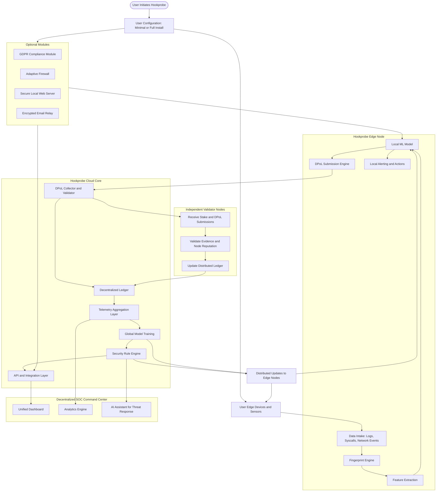

# HookProbe DSM: A Decentralized Security Mesh for the Modern Internet

**An Open-Source, DIY Framework for Distributed Detection, Response & Trust Validation**

*work in progress*

---


---

## Abstract

The rapid decentralization of computing has created a world where traditional centralized Security Operations Centers (SOCs) can no longer keep pace with an increasingly distributed attack surface. Homes, small businesses, mobile networks, and edge devices generate high-value security telemetry but lack the infrastructure to correlate, authenticate, and respond effectively.

**HookProbe DSM** (Decentralized Security Mesh) introduces a novel, open-source architecture for building a distributed, tamper-evident, cryptographically verifiable SOC that spans from the network edge to the cloud. Designed for the DIY community, cybersecurity hobbyists, makers, small enterprises, and MSSPs, HookProbe DSM offers a modular, container-based platform built around:

- **Accurate detection** using IDS/IPS, Zeek, eBPF/XDP
- **Cryptographic attestation** of nodes, events, and responses
- **A lightweight ledger** ("proof-of-attestation") for event chaining
- **AI-enhanced triage and mitigation**
- **Autonomous POD architecture** for modular upgrades
- **Federated insights** across multiple edges

HookProbe DSM empowers users to construct professional-grade security capabilities using low-cost hardware, open-source tools, and a decentralized trust model adaptable to a wide array of environments.

---

## 1. Introduction

Cybersecurity is undergoing a structural transformation. The classic SOC model—centralized, monolithic, expensive—fails to address:

- The **decentralization of data**
- Proliferation of **IoT and edge devices**
- **Remote work** and mobile-first infrastructures
- **Carrier-Grade NAT (CGNAT)** constraints
- Increasing **supply-chain vulnerabilities**
- The need for **local autonomy** in detection and response

HookProbe DSM responds to these challenges by reimagining the SOC as a **distributed mesh of intelligent, cryptographically hardened nodes** capable of:

- Operating independently at the edge
- Synchronizing securely with an optional MSSP cloud
- Sharing anonymized threat intelligence
- Producing tamper-evident logs and automated responses
- Maintaining policy consistency across all nodes

This whitepaper outlines the architecture, components, security primitives, consensus model, and operational workflow of the HookProbe DSM system.

---

## 2. Vision & Goals

HookProbe DSM aims to deliver:

### 2.1 A decentralized SOC for everyone
From smart homes to small enterprises, HookProbe democratizes SOC capability.

### 2.2 Zero-trust communication mesh
Every edge and cloud component is mutually authenticated through TPM-backed identities.

### 2.3 Tamper-evident event logs
Every detection and mitigation event is part of a cryptographically verifiable chain.

### 2.4 Open-source, DIY-friendly
Runs on Raspberry Pi-class SBCs, NUCs, servers, or cloud instances.

### 2.5 Modular POD architecture
Users install only what they need: detection, WAF, email, automation, dashboards, etc.

### 2.6 A resilient command model
No single point of failure—authority is shared across nodes.

---

## 3. System Architecture Overview

HookProbe DSM uses a POD-based microservice architecture encapsulated in lightweight container stacks.

### 3.1 Core PODs

| POD | Function |
|-----|----------|
| 001 | Web Management UI / API gateway / DMZ services |
| 002 | IAM: Identity, Auth, RBAC, SSO |
| 003 | Persistent DB (PostgreSQL + encrypted volumes) |
| 004 | Transient data, cache, queues (Redis/Valkey) |
| 005 | Metrics, Logs, Dashboards (ClickHouse, Grafana, VictoriaMetrics) |
| 006 | Security Detection: Suricata, Snort3, Zeek, XDP/eBPF sensors |
| 007 | Autonomous AI Response & Mitigation Engine |

### 3.2 Optional PODs

| POD | Function |
|-----|----------|
| 008 | Workflow Automation (n8n, hooks, defensive playbooks) |
| 009 | Email System, Cloudflare Tunnel, Notification Mesh |
| 010+ | Partner modules, citizen-science modules, ML pipelines |

---

## 4. Decentralized Security Mesh (DSM)

The cornerstone of HookProbe's innovation is a distributed ledger-inspired trust model.

**Not a blockchain.**
**Not a cryptocurrency.**
**Not mining.**

Instead, DSM uses a **lightweight Merkle-DAG with RAFT-like consensus** to sign, validate, and propagate:

- Alerts
- Telemetry summaries
- Mitigation commands
- Policy updates
- Threat intelligence

### 4.1 Block Structure (Event Block)

Each block contains:

```
prev_hash
timestamp
node_identity
event_type
payload_hash
signatures (edge + cloud quorum)
```

This forms an **append-only chain** which is:

- **Tamper-evident**
- **Cryptographically signed**
- **Locally verifiable**
- **Globally distributable**

### 4.2 Consensus: Proof-of-Attestation (PoA)

Rather than PoW or PoS, HookProbe uses:

- **TPM-backed hardware identity**
- **Node integrity measurements** (PCR values)
- **Mutual TLS**
- **Peer-signed validation**

Only trusted, attested nodes can add blocks.

---

## 5. Security Components

### 5.1 Detection Layer

HookProbe DSM integrates:

- **Suricata / Snort3** signature engines
- **Zeek** behavioral analysis
- **XDP/eBPF** packet processors
- **TLS fingerprinting**
- **Domain reputation**
- **AI-driven local anomaly detection**

Detection events become **signed blocks**.

### 5.2 Autonomous Response Layer

POD-007 executes:

- Firewall rule injection
- Rate limiting
- Process containment
- Remote sinkholing
- Automatic WAF rule deployment
- User notifications
- Triggered workflows via POD-008

All responses are logged as cryptographically signed **"mitigation blocks"**.

---

## 6. Identity, Attestation & Trust

### 6.1 Edge Identity

Each node generates a hardware-backed keypair stored in:

- **TPM 2.0**
- **ARM TrustZone**
- **Intel TXT/SGX**
- **Qualcomm SDX65 secure enclave** (supported)

### 6.2 Cloud Attestation Authority

The cloud backend signs node certificates and issues:

- **Node UUID**
- **Policy fingerprint**
- **Cluster membership token**

### 6.3 Mutual Verification

Edges verify cloud policy signatures. Cloud verifies edge integrity (PCR measurements).

---

## 7. Data Flow

1. Packet enters edge device
2. XDP/eBPF captures or redirects to Suricata/Zeek
3. Event is classified
4. Event is hashed → block created
5. Node signs block
6. Block sent to cloud quorum
7. Cloud (or peers) validate hash + signature
8. Block appended to DSM chain
9. AI response determines mitigation
10. Mitigation block created & signed
11. Dashboards update in real-time

---

## 8. Threat Intelligence Mesh

HookProbe DSM forms an **edge-to-edge intelligence network**.

When one edge detects:

- C2 traffic
- Malware signature
- Beaconing
- Scans
- Exploitation attempt

It synthesizes a **Threat Advisory Block**.

All peer edges ingest it automatically and update:

- WAF rules
- IDS signatures
- ML-based anomaly detection
- Zero-trust ACLs

This creates a **community-driven defense lattice**.

---

## 9. Deployment Models

### 9.1 Edge Deployment
For homes, SMBs, remote branches.

- Runs full DSM stack locally
- Cloud optional
- Works offline
- Can sync when connection restored

### 9.2 MSSP Cloud Backend
Supports:

- Multi-tenant architecture
- Heavy analytics
- Long-term retention (365–2000 days)
- Cross-tenant anonymized intelligence

### 9.3 Hybrid (Recommended)
Edges autonomously operate. Cloud aggregates, coordinates, and visualizes.

---

## 10. Use Cases

### 10.1 Smart Homes
Detect IoT anomalies, rogue APs, malware, DNS tunneling.

### 10.2 Home Labs & Hackerspaces
Great for DIY learning, packet analysis, threat hunting.

### 10.3 Small Businesses
Replace expensive appliances with modular PODs.

### 10.4 MSPs/MSSPs
Deploy DSM to multiple clients for unified analytics.

### 10.5 Remote Work Environments
Secure BYOD and roaming laptops across CGNAT.

---

## 11. Performance & Scalability

HookProbe DSM is engineered for constrained environments:

- Runs on SBCs with **2–4GB RAM**
- Can process **1–2 Gbit/s on ARM** with XDP
- **ClickHouse** provides high-ingest analytics
- Cluster scaling via **RAFT and sharded DBs**

For heavy workloads, the MSSP backend handles:

- Cross-tenant analytics
- Historical data stores
- Federated model training

---

## 12. Open Source & Community

HookProbe DSM is:

- **100% open source**
- Designed for **DIY enthusiasts**
- Encourages **forks, plugins, custom PODs**
- **Community-driven** WAF/IDS rules
- Built on **transparent, auditable code**

---

## 13. Roadmap

| Phase | Deliverable |
|-------|-------------|
| Q1 | DSM ledger prototype, RAFT consensus |
| Q2 | Full POD integration, attestation engine |
| Q3 | Threat Intelligence Mesh federation |
| Q4 | Decentralized AI response engine |
| Q5 | Open consortium launch (Hackers / Makers SOC Network) |

---

## 14. Conclusion

HookProbe DSM represents a fundamental evolution of the SOC model—moving from centralized, fragile, expensive security systems toward a **distributed, community-driven, cryptographically verifiable mesh**.

By combining open-source software, affordable hardware, and a trust-by-design architecture, HookProbe DSM empowers individuals, small businesses, and MSSPs to build advanced security infrastructures previously accessible only to large enterprises.

**HookProbe DSM is not just a product. It is a movement toward decentralized cybersecurity.**

---

## Related Documentation

- [HookProbe Security Model](security-model.md) - Detailed security architecture
- [POD Components Overview](../components/README.md) - All POD modules
- [MSSP Dashboard](../dashboards/mssp-dashboard.md) - Security operations interface
- [Main README](../../README.md) - Project overview and features

---

**Version**: 1.0 (Draft)
**Last Updated**: 2025-11-26
**Maintained by**: HookProbe Team
