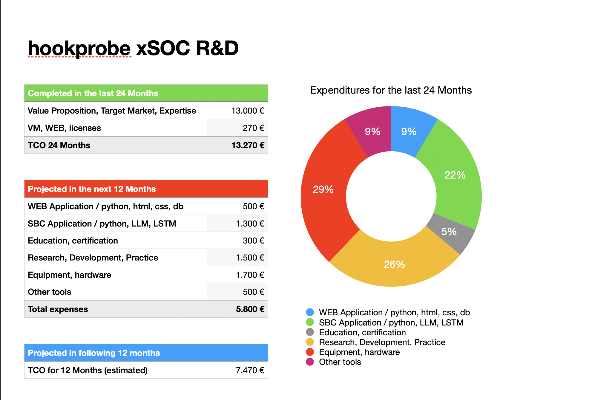

# hookprobe xSOC R&D expenditure

**Past Expenditure (13,270 € over 24 months):**  
In the past two years, our investment has focused on foundational technology costs, which include initial research and development, software procurement, and workforce training. These resources enabled us to explore the application of AI-driven insights in our product line, laying the groundwork for future AI-driven solutions.

**Upcoming Expenditure (5,800 € over 12 months):**  
The next year’s budget emphasizes scaling our AI capabilities, particularly with Large Language Models (LLMs) which are crucial for refining our product development processes. This expenditure will support integrating LLMs to enhance content generation, customer service automation, and product refinement. LLMs offer vast potential to streamline creative and operational tasks, reducing time-to-market and improving product relevance. However, the high computational demands of LLMs mean we need to carefully manage resource allocation to avoid escalating costs.

**Future Expenditure (7,470 € in the following 12 months):**  
In the subsequent year, we aim to enhance our proprietary solutions by developing AI-based models tailored to specific customer needs. This budget is allocated for custom AI tools and user-centered model training that fine-tune the application of LLMs in our products, potentially creating a more adaptable and engaging customer experience. 

### The Role of AI in New Product Development
As we increase our reliance on AI, we foresee benefits in areas such as predictive analytics, customer feedback analysis, and real-time data processing. However, balancing the advantages with risks—such as reliance on costly technology and the complexities of model management—is critical. By strategically deploying LLMs, we can empower our development team, optimize resources, and advance our products with a focus on efficiency and value.

