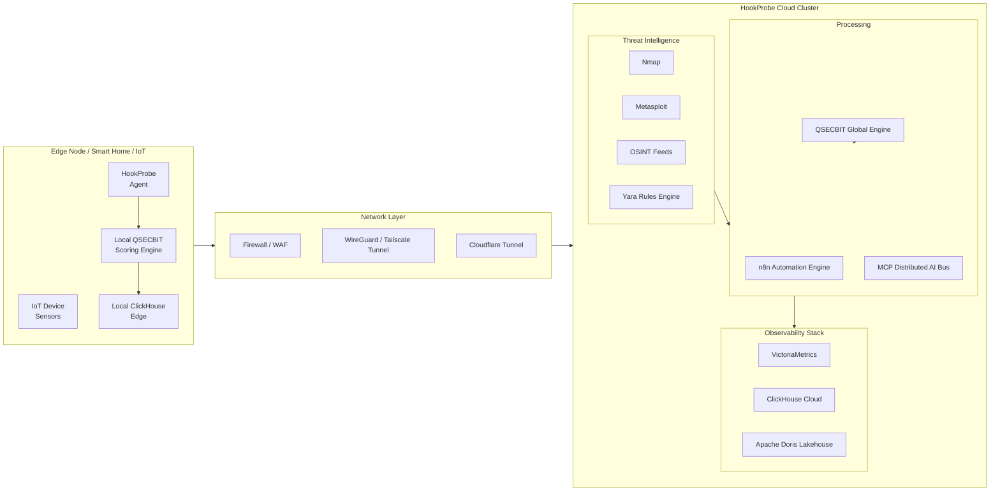
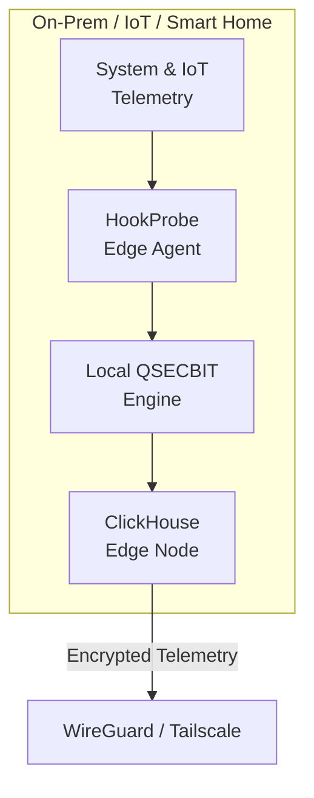
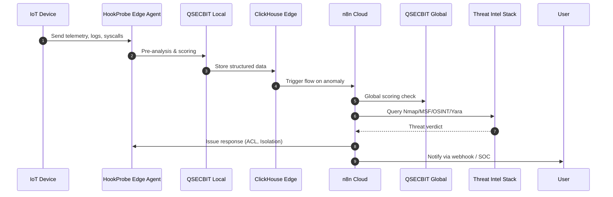

### 🔥 HookProbe Autonomous Defense – N8N Automation Framework

N8N + qSecBit + Modern Data Pipelines (ClickHouse / VictoriaMetrics / Doris)

High-Performance Automation for Securing Every Device, Everywhere

HookProbe’s mission is to democratize autonomous cybersecurity across small businesses, smart homes, and edge devices using open-source, high-signal automation.


# HOOKPROBE AUTOMATION FLOW  
## Unified Cyber-Defense Pipeline for QSECBIT Integration  
This document defines the next-generation automated cybersecurity pipeline for **HookProbe**, integrating **n8n**, **QSECBIT algorithmic scoring**, **ClickHouse**, **VictoriaMetrics**, **Apache Doris**, and cloud + edge deployments.  
It includes **full deployment architecture diagrams (Mermaid)** and a **real-time defense workflow** optimized for 2025 threat models.

---

# 1. High-Level Architecture (Mermaid)
   


# 2. n8n Automation Flow (Mermaid)
```mermaid
flowchart TD
    A["Event Trigger<br>Logs / Syscalls / Packets"] --> B["QSECBIT<br>Pre-Filter"]
    B -->|Risk >= 0.7| C["Deep Packet &<br>Behavior Analysis"]
    B -->|Risk < 0.7| Z["Store &<br>Monitor Only"]

    C --> D{"Correlate Against<br>Threat Feeds?"}
    D -->|Yes| E["Nmap Active<br>Validation"]
    D -->|Yes| F["Metasploit<br>Fingerprint Match"]
    D -->|Yes| G["Yara File<br>Scan"]
    D -->|No| Z

    E --> H["ClickHouse<br>Store"]
    F --> H
    G --> H

    H --> I["VictoriaMetrics<br>Time-Series Alerts"]
    I --> J{"Severity >= High?"}

    J -->|Yes| K["Automated Response<br>Engine"]
    J -->|No| Z

    K --> L["Network ACL<br>Push"]
    K --> M["Edge Node<br>Isolation"]
    K --> N["Cloudflare<br>Zero-Trust Update"]

    N --> O["Notify SOC<br>Webhook / Chat"]

 ```

# 3. Full Cloud Deployment Diagram (Mermaid)
```mermaid
flowchart LR
    subgraph CLOUD["Cloud Cluster"]
        LB["Load Balancer"]
        API["HookProbe API<br>Gateway"]
        N8N["n8n Automation Nodes"]
        MCP["MCP AI Messaging Bus"]
        QSEC["QSECBIT Scoring Engine"]
        CH["ClickHouse HA Cluster"]
        VM["VictoriaMetrics Cluster"]
        DORIS["Apache Doris Storage"]
        REDIS["Redis Cache"]
    end

    LB --> API --> N8N
    API --> CH
    API --> VM
    API --> DORIS
    N8N --> MCP --> QSEC
    QSEC --> CH
    VM --> N8N
```

# 4. Edge Deployment Diagram (Mermaid)


# 5. End-to-End Data Flow (Mermaid Sequence Diagram)


---

# 6. Deployment Targets

| Environment | Components |
|------------|------------|
| **Edge** | HookProbe Agent, Local QSECBIT, ClickHouse Edge |
| **Cloud** | Distributed n8n, MCP, QSECBIT Global, ClickHouse, VictoriaMetrics, Doris |
| **Hybrid** | Full telemetry path with encrypted tunnels |
| **Threat Intel** | Nmap, Metasploit, OSINT, Yara |

---

# 7. Innovation Areas

- QSECBIT-based **adaptive threat scoring** (higher certainty & lower noise)
- Multi-database architecture with CH + Doris for **OLAP + lakehouse fusion**
- VictoriaMetrics for **real-time TS analytics**
- n8n + MCP for **autonomous cybersecurity orchestration**
- Edge-first model for **privacy, latency reduction, and survivability**

---

# 8. File Generated by ChatGPT (automation.md)
This file contains **all diagrams**, **architecture**, and **deployment flows** ready for GitHub integration.


This repository contains the HookProbe Automated Defense Flow, powered by:

N8N Automation Engine

qSecBit Security Algorithms + Resilience Scoring

ClickHouse / VictoriaMetrics / Apache Doris pipelines

Edge sensors, containers, and proactive scanning modules

All modules below are optional, plug-and-play components that can be added onto an existing HookProbe N8N deployment inside Podman/RHEL.

### 🚀 Architecture Overview
The system is designed around the core loop of catching → learning → adapting → self-healing.

Code snippet
graph TD
    A[Sensors: Suricata / Zeek / Falco / Osquery / Podman Events / qSecBit Agent] --> B;
    B[qSecBit Intelligence Layer - Resilience Algorithm + Threat Context Engine] --> C;
    C[N8N Automation Bus - Correlation + Action Flows] --> D1[Local Edge Stack: ClickHouse / VictoriaMetrics];
    C --> D2[Cloud Stack: Doris / S3 / GitOps];
HookProbe strategically uses modern data platforms:

ClickHouse for high-speed log ingestion & threat timeline queries.

VictoriaMetrics for lightweight time-series telemetry at the edge.

Apache Doris for federated multi-tenant analytics in the cloud.

Every automation flow feeds into the Resilience Metrics Engine to measure: Exposure → Response Time → Stability → Auto-Healing Capacity.

🧠 Core Concept: qSecBit Integrated Defense Algorithms
The qSecBit algorithmic layer enhances every component, driving the self-healing capability.

qSecBit Enhancements:

Adaptive Exposure Scoring per endpoint.

Learning-based anomaly thresholds.

Attack surface compression (reduce unnecessary telemetry noise).

Resilience Score (0–100):

Measures how fast, how accurately, and how consistently a system defends itself. This creates a cyber-resilient environment, where attacks fuel automatic improvement.

📦 Deployment & Flow Structure
Each module is self-contained for easy deployment via Ansible:

Component	Description
/ansible/playbooks/<module>.yaml	Ansible playbooks for provisioning.
/flows/<module>.json	Importable N8N workflows (the automation logic).
/sensors/<module>	Edge collectors and sensor configurations.
/pipelines/<module>	ClickHouse / VM / Doris schema & ingestion scripts.
🧩 Modular Components
Modules are grouped by their Impact and Catch Probability to guide deployment priority.

🟢 GROUP A — Highest Impact & Highest Catch Rate (Deploy First)

#	Module	Core Functionality	Innovation & Pipeline
1.	Continuous Attack Surface Mapper	Detects new ports, devices, services. API diff engine highlights meaningful changes.	qSecBit learns behavioral baselines for your network. Pipeline: ClickHouse (hp_surface_ch).
2.	Real-Time Credential Attack Defense	Detects Brute force, Credential stuffing, IoT login anomalies.	Adaptive ban decisions based on Resilience Score. Auto PF → nftables → cloud firewall sync.
3.	Container Runtime Guardian	Detects Privileged containers, unexpected ports, suspicious syscalls (using Podman Events + Falco).	Action: Auto-kill, image rollback. Pipeline: Doris for multi-site container anomaly analytics.
4.	IoT Device Integrity & TPM PCR Monitor	Detects Unauthorized firmware changes, PCR drift, modified boot parameters.	Action: Auto-segment device via VXLAN/PSK rotation. Triggers MCP-based integrity scripts.
🟡 GROUP B — Medium Impact, High Optional Value

5. DNS / C2 Detection + Auto Block Pipeline: Detects DNS rebinding, C2 patterns. Uses PiHole + Suricata. Action: Auto block domain, update community feed. Pipeline: VictoriaMetrics (fast DNS telemetry).

6. SOC-Light Behavior Analytics: Generates Resilience Metrics based on lateral movement, data exfil patterns, and protocol misuse. Useful for small businesses with no SOC.

7. Phishing → RAT → Lateral Movement Predictor: qSecBit algorithm calculates the likelihood of pivot attempts, creating early-warning alerts before damage occurs.

🟠 GROUP C — Lower Frequency, High Value for Learning

8. Metasploit SafeMode Tester: Weekly or on-demand validation using non-exploit scanners. Action: Auto-generate remediation PR and suggest patch playlists. Pipeline: ClickHouse for vulnerability timelines.

9. Data Exfiltration Kill-Switch: Detects sudden upstream traffic or large bursts in encrypted tunnels. Action: Cut outbound interface, generate forensic package. Store evidence in Doris for multi-tenant analysis.

10. Zero-Click Wireless Threat Monitor: Catches Evil Twin APs, Bluetooth beacon attacks, Rogue NFC triggers. Edge collector → qSecBit behavior classifier → N8N isolation flow.

🧭 Development Roadmap
The roadmap is focused on delivering functional, measurable defense capabilities at each phase.

Phase	Objective	Key Deliverables
Phase 1	Core Defense (MVP)	Surface Mapper, Credential Defense, Container Guardian modules.
Phase 2	Resilience Algorithms	Exposure Score, Resilience Score DB, qSecBit SDK.
Phase 3	Edge Data Pipelines	ClickHouse + VictoriaMetrics installation, Schemas, Ingestion, Dashboards.
Phase 4	Cloud Fusion Layer	Apache Doris multi-tenant analytics, User portal, Cross-network detection.
Phase 5	Predictive Defense	AI-based behavior prediction, RAT trajectory modeling, Anomaly forecast.
Phase 6	Community Threat Exchange	Federated open-source defense, Shared indicators, Resilience challenges.
Phase 7	Autonomous Remediation	Zero-touch incident handling, Auto-segmentation, PSK rotation, Rollback pipeline.
📌 Conclusion
The combination of qSecBit algorithms + N8N automation + modern data platforms creates a groundbreaking, self-correcting cybersecurity ecosystem built for:

High catch rate and high signal, low noise.

Self-learning telemetry and Resilience-driven outcomes.

Edge-ready performance and Cloud-scale analytics.

Open-source transparency.

This framework shifts defense from manual response to truly autonomous defense.
