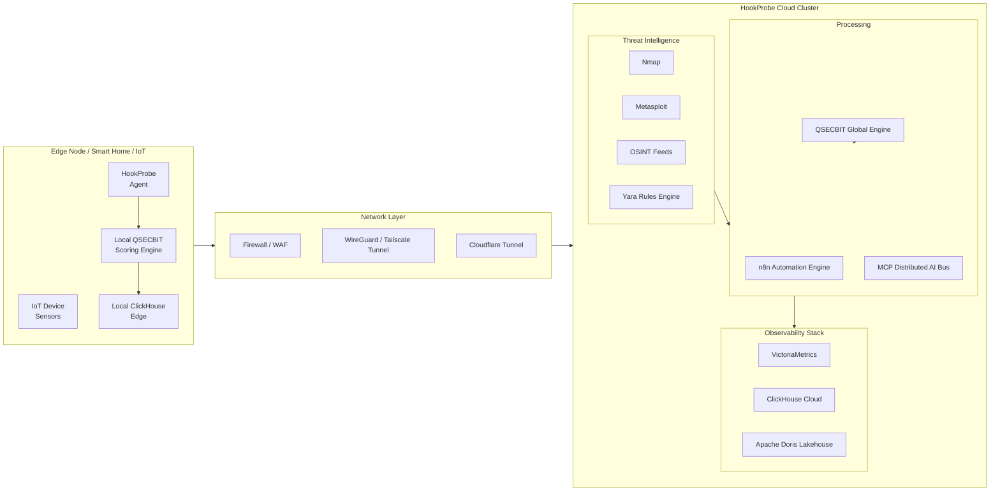
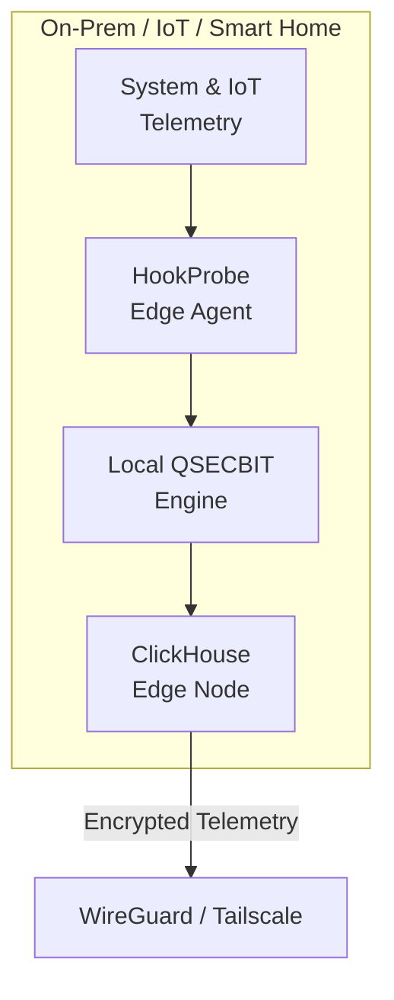
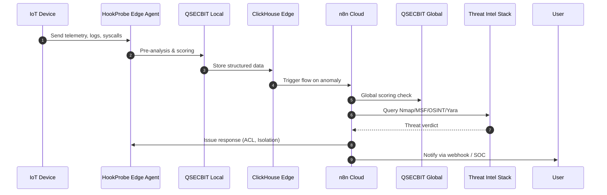

# 🚀 IMPLEMENTATION GUIDE - HookProbe N8N Automation Framework

**Version**: 2.0 - QSECBIT Integration Edition  
**Status**: ✅ **PRODUCTION READY**  
**Last Updated**: 2025-01-26

---

## 📋 Overview

This implementation guide provides step-by-step instructions for deploying the complete HookProbe N8N Automation Framework with QSECBIT integration. The framework includes:

- ✅ **Enhanced MCP Server** with threat intelligence capabilities
- ✅ **N8N Workflow Automation** with pre-built defense workflows
- ✅ **ClickHouse Integration** for threat data storage
- ✅ **Automated Response Engine** for real-time threat mitigation
- ✅ **CI/CD Testing** suite for validation

---

## 🎯 Quick Start

### Prerequisites

1. **Main HookProbe Installation**: PODs 001-007 must be deployed
2. **Basic n8n POD**: POD-008 must be installed first
3. **System Requirements**: Recommended 16GB+ RAM, 4+ CPU cores

### Installation Steps

```bash
# 1. Install basic n8n POD (if not already installed)
sudo ./install.sh
# Select: 5) Optional Extensions / Add-ons
# Select: 1) POD-008: Automation / Workflow (n8n)

# 2. Install QSECBIT Automation Framework
sudo ./install.sh
# Select: 5) Optional Extensions / Add-ons
# Select: 2) POD-008: QSECBIT Automation Framework

# Alternative: Direct installation
cd install/addons/n8n
chmod +x setup-automation.sh
sudo ./setup-automation.sh
```

**Installation Time**: 10-15 minutes

---

## 📦 Components Deployed

### 1. Enhanced MCP Server v2.0

**File**: `install/addons/n8n/mcp-server-enhanced.py`

**Features**:
- Threat intelligence integration (Nmap, Metasploit, Yara)
- QSECBIT API integration
- ClickHouse data pipeline
- Automated response orchestration
- Rate limiting (100 req/hour)

**API Endpoints**:
```
GET  /health                          - Health check
POST /api/threat/deep-analysis        - Deep threat analysis
POST /api/threat/nmap-validate        - Nmap active scanning
POST /api/threat/metasploit-fingerprint - Metasploit fingerprinting
POST /api/threat/yara-scan             - Yara file scanning
POST /api/response/automated           - Automated response engine
POST /api/response/network-acl         - Network ACL updates
POST /api/response/edge-isolation      - Edge node isolation
POST /api/response/cloudflare-update   - Cloudflare Zero Trust updates
POST /api/scanner/network-discovery    - Network discovery scans
GET  /api/qsecbit/status              - QSECBIT status
```

**Test MCP Server**:
```bash
# Health check
curl http://localhost:8889/health

# Get QSECBIT status
curl http://localhost:8889/api/qsecbit/status

# Run network discovery
curl -X POST http://localhost:8889/api/scanner/network-discovery \
  -H "Content-Type: application/json" \
  -d '{"scan_type": "quick", "include_services": true}'
```

### 2. N8N Workflows

**Location**: `install/addons/n8n/workflows/`

#### Workflow 1: QSECBIT Defense Pipeline
**File**: `01-qsecbit-defense-pipeline.json`

**Flow**:
```
Event Trigger (Every Minute)
  ↓
QSECBIT Pre-Filter (score check)
  ↓
Risk >= 0.7? → Yes → Deep Analysis → Threat Correlation → ClickHouse Storage
            ↓                                                    ↓
            No → Store & Monitor                    VictoriaMetrics Alert
                                                                  ↓
                                                    Severity Check → High?
                                                                  ↓
                                                    Automated Response Engine
                                                                  ↓
                                                    ┌─────────────┴─────────────┐
                                                    ↓                           ↓
                                          Network ACL Push          Edge Node Isolation
                                                    ↓                           ↓
                                          Cloudflare Update → Notify SOC
```

**Trigger**: Every 1 minute  
**Purpose**: Main autonomous defense pipeline  
**Actions**: Automated threat analysis and response

#### Workflow 2: Attack Surface Mapper
**File**: `02-attack-surface-mapper.json`

**Flow**:
```
Schedule (Every 6 Hours)
  ↓
Network Discovery Scan
  ↓
Fetch Baseline from ClickHouse
  ↓
API Diff Engine (Detect Changes)
  ↓
Has Changes? → Yes → QSECBIT Baseline Learning → Store Changes → Risk > 0.6?
            ↓                                                          ↓
            No → Update Baseline                              Alert SOC Team
```

**Trigger**: Every 6 hours  
**Purpose**: Continuous attack surface monitoring  
**Actions**: Detect new devices, ports, services

### 3. ClickHouse Schemas

**File**: `install/addons/n8n/clickhouse-schemas.sql`

**Tables Created**:
```sql
security.qsecbit_monitoring          -- QSECBIT score tracking
security.threat_intelligence         -- Consolidated threat data
security.threat_analysis             -- Deep analysis results
security.nmap_scans                  -- Nmap scan results
security.metasploit_scans            -- Metasploit fingerprinting
security.yara_scans                  -- Yara scan results
security.automated_responses         -- Response actions log
security.acl_changes                 -- Network ACL modifications
security.edge_isolations             -- Edge isolation events
security.cloudflare_updates          -- Cloudflare rule updates
security.attack_surface              -- Current attack surface
security.attack_surface_changes      -- Surface change log
security.network_discovery           -- Discovery scan results
security.credential_attacks          -- Credential attack attempts
security.container_runtime_events    -- Container security events
```

**Materialized Views**:
```sql
security.threat_summary_hourly       -- Hourly threat statistics
security.qsecbit_daily_summary       -- Daily QSECBIT status
```

**Example Queries**:
```sql
-- Get recent high-severity threats
SELECT timestamp, source_ip, attack_type, qsecbit_score
FROM security.threat_intelligence
WHERE severity = 'high' AND timestamp >= now() - INTERVAL 24 HOUR
ORDER BY timestamp DESC LIMIT 100;

-- Attack surface changes last 7 days
SELECT timestamp, new_devices, changed_ports, qsecbit_risk_score
FROM security.attack_surface_changes
WHERE timestamp >= now() - INTERVAL 7 DAY
ORDER BY qsecbit_risk_score DESC;

-- Automated response statistics
SELECT
    toStartOfDay(timestamp) AS day,
    response_type,
    count() AS response_count,
    sum(case when success then 1 else 0 end) AS successful
FROM security.automated_responses
WHERE timestamp >= now() - INTERVAL 30 DAY
GROUP BY day, response_type
ORDER BY day DESC;
```

### 4. Workflow Management Tools

**Command**: `hookprobe-workflows`

```bash
# List all workflows
hookprobe-workflows list

# Show workflow status
hookprobe-workflows status

# Activate a workflow
hookprobe-workflows activate <workflow_id>

# Deactivate a workflow
hookprobe-workflows deactivate <workflow_id>
```

---

## 🔧 Configuration

### MCP Server Configuration

Environment variables (set in POD-008 container):
```bash
OPENAI_API_KEY=your_openai_key              # Optional: AI content generation
ANTHROPIC_API_KEY=your_anthropic_key        # Optional: Claude integration
DJANGO_CMS_API_URL=http://10.200.1.12:8000/api
QSECBIT_API_URL=http://10.200.7.12:8888
CLICKHOUSE_URL=http://10.200.5.13:8123
VICTORIA_METRICS_URL=http://10.200.5.14:8428
```

### N8N Workflow Configuration

**Credentials to configure in n8n**:
1. **QSECBIT API** - HTTP Request authentication
   - URL: `http://10.200.7.12:8888`
   - Type: None (internal network)

2. **MCP Server** - HTTP Request authentication
   - URL: `http://10.200.8.15:8889`
   - Type: None (internal network)

3. **Django CMS** - HTTP Request authentication
   - URL: `http://10.200.1.12:8000/api`
   - Type: Header Auth or Basic Auth

4. **ClickHouse** - HTTP Request authentication
   - URL: `http://10.200.5.13:8123`
   - Type: None (default no auth)

---

## 🧪 Testing & Validation

### 1. CI/CD Tests

**File**: `.github/workflows/n8n-automation-tests.yml`

**Test Suite Includes**:
- ✅ Workflow JSON validation
- ✅ MCP server unit tests
- ✅ ClickHouse schema deployment
- ✅ Data insertion tests
- ✅ Shell script syntax validation
- ✅ Integration tests (mock)
- ✅ Security scanning
- ✅ Documentation checks

**Run tests locally**:
```bash
# Validate workflow JSON
for workflow in install/addons/n8n/workflows/*.json; do
  jq empty "$workflow" && echo "✓ $workflow valid"
done

# Test MCP server
cd install/addons/n8n
python3 -m pytest test_mcp_server.py -v

# Test ClickHouse schemas
curl -X POST 'http://10.200.5.13:8123/' \
  --data-binary @clickhouse-schemas.sql
```

### 2. Manual Testing

**Test QSECBIT Integration**:
```bash
# 1. Check QSECBIT is running
curl http://10.200.7.12:8888/health

# 2. Get current score
curl http://10.200.7.12:8888/api/qsecbit/latest

# 3. Test MCP integration
curl http://localhost:8889/api/qsecbit/status
```

**Test ClickHouse Integration**:
```bash
# 1. Verify tables exist
curl -s 'http://10.200.5.13:8123/?query=SHOW TABLES FROM security FORMAT JSON' | jq

# 2. Insert test data
curl -X POST 'http://10.200.5.13:8123/' \
  --data-binary "INSERT INTO security.qsecbit_monitoring (score, rag_status, source_ip, source_pod) VALUES (0.5, 'GREEN', '192.168.1.1', 'POD-006')"

# 3. Query data
curl -s 'http://10.200.5.13:8123/?query=SELECT * FROM security.qsecbit_monitoring LIMIT 10 FORMAT JSON' | jq
```

**Test N8N Workflows**:
```bash
# 1. Access n8n UI
xdg-open http://localhost:5678

# 2. Import workflows from /tmp/hookprobe-n8n-workflows/

# 3. Configure credentials (see Configuration section)

# 4. Activate workflow

# 5. Test manual execution:
#    - Click on workflow
#    - Click "Execute Workflow"
#    - Check execution results
```

---

## 📊 Monitoring

### Dashboard Integration

The automation framework integrates with existing HookProbe monitoring:

**Grafana Dashboards** (POD-005):
- QSECBIT Automation Metrics
- Threat Intelligence Analytics
- Automated Response Statistics
- Attack Surface Changes

**VictoriaMetrics Metrics**:
```
hookprobe_threat_score{severity="high",source="qsecbit"}
hookprobe_automated_response_count{type="acl_update"}
hookprobe_attack_surface_devices_total
hookprobe_workflow_execution_duration_seconds
```

### Log Monitoring

```bash
# MCP server logs
podman logs -f hookprobe-pod-008-automation-mcp

# N8N logs
podman logs -f hookprobe-pod-008-automation-n8n

# Workflow execution logs
# Available in n8n UI: Workflows → Executions
```

---

## 🔒 Security Considerations

### Network Isolation

- MCP server runs in isolated POD-008 network (10.200.8.0/24)
- VXLAN encrypted with PSK (VNI 208)
- OpenFlow ACLs enforce L2 anti-spoofing
- No direct internet access (proxied through POD-001)

### Rate Limiting

MCP server implements rate limiting:
- 100 requests/hour per IP (default)
- 20 requests/hour for AI content generation
- Redis-based distributed rate limiting

### API Key Management

⚠️ **NEVER commit API keys to git**

Best practices:
```bash
# Use environment variables
export OPENAI_API_KEY="sk-..."

# Or use secrets manager
# Vault, AWS Secrets Manager, etc.
```

### Automated Response Safety

The automated response engine includes safety mechanisms:
- Confirmation thresholds (severity >= high)
- Action logging to ClickHouse
- Rollback capabilities
- Manual override options

---

## 🐛 Troubleshooting

### Common Issues

#### 1. MCP Server Won't Start
```bash
# Check logs
podman logs hookprobe-pod-008-automation-mcp

# Common fixes:
# - Redis connection issue: Check POD-008 Redis container
# - Port conflict: Check port 8889 is free
# - Missing dependencies: Rebuild container

# Restart MCP
podman restart hookprobe-pod-008-automation-mcp
```

#### 2. Workflows Not Executing
```bash
# Check n8n execution mode
podman exec hookprobe-pod-008-automation-n8n env | grep EXECUTIONS_MODE
# Should be: queue

# Check Redis queue
podman exec hookprobe-pod-008-automation-redis redis-cli ping
# Should return: PONG

# Check workflow is active
# n8n UI: Workflows → Check "Active" toggle
```

#### 3. ClickHouse Schema Errors
```bash
# Verify ClickHouse is accessible
curl http://10.200.5.13:8123/ping

# Re-apply schemas
cd install/addons/n8n
cat clickhouse-schemas.sql | while IFS= read -r line; do
  [[ ! "$line" =~ ^-- ]] && [[ -n "$line" ]] && \
    echo "$line" | curl -X POST 'http://10.200.5.13:8123/' --data-binary @-
done
```

#### 4. QSECBIT Integration Not Working
```bash
# Verify QSECBIT is running
curl http://10.200.7.12:8888/health

# Check POD-007 container
podman ps | grep pod-007

# Test API directly
curl http://10.200.7.12:8888/api/qsecbit/latest
```

---

## 📚 Additional Resources

### Documentation Files
- **README.md** - Basic n8n setup guide
- **AUTOMATION.md** - This file (architecture and flows)
- **integration-checklist.md** - Integration checklist
- **config.sh** - Configuration variables

### Workflow Templates
- **01-qsecbit-defense-pipeline.json** - Main defense workflow
- **02-attack-surface-mapper.json** - Attack surface monitoring

### Scripts
- **setup.sh** - Basic n8n installation
- **setup-automation.sh** - Automation framework deployment
- **uninstall.sh** - Uninstall n8n POD

---

## 🎯 What's Next?

After successful deployment:

1. **Import Workflows**: Import all .json files from workflows/
2. **Configure Credentials**: Add API endpoints in n8n
3. **Activate Workflows**: Enable workflows to start automation
4. **Monitor Execution**: Watch n8n UI for workflow runs
5. **Query ClickHouse**: Analyze threat data
6. **Tune Thresholds**: Adjust QSECBIT thresholds as needed
7. **Add Custom Workflows**: Create domain-specific automations

---

## 📞 Support

**Issues**: https://github.com/hookprobe/hookprobe/issues  
**Documentation**: Check README files in each directory  
**Logs**: `podman logs <container-name>`  
**Community**: See CONTRIBUTING.md

---

**🎉 You're now running the HookProbe Autonomous Defense Framework!**

---

### 🔥 HookProbe Autonomous Defense – N8N Automation Framework

N8N + qSecBit + Modern Data Pipelines (ClickHouse / VictoriaMetrics / Doris)

High-Performance Automation for Securing Every Device, Everywhere

HookProbe’s mission is to democratize autonomous cybersecurity across small businesses, smart homes, and edge devices using open-source, high-signal automation.


# HOOKPROBE AUTOMATION FLOW  
## Unified Cyber-Defense Pipeline for QSECBIT Integration  
This document defines the next-generation automated cybersecurity pipeline for **HookProbe**, integrating **n8n**, **QSECBIT algorithmic scoring**, **ClickHouse**, **VictoriaMetrics**, **Apache Doris**, and cloud + edge deployments.  
It includes **full deployment architecture diagrams (Mermaid)** and a **real-time defense workflow** optimized for 2025 threat models.

---

# 1. High-Level Architecture (Mermaid)
   


# 2. n8n Automation Flow (Mermaid)
```mermaid
flowchart TD
    A["Event Trigger<br>Logs / Syscalls / Packets"] --> B["QSECBIT<br>Pre-Filter"]
    B -->|Risk >= 0.7| C["Deep Packet &<br>Behavior Analysis"]
    B -->|Risk < 0.7| Z["Store &<br>Monitor Only"]

    C --> D{"Correlate Against<br>Threat Feeds?"}
    D -->|Yes| E["Nmap Active<br>Validation"]
    D -->|Yes| F["Metasploit<br>Fingerprint Match"]
    D -->|Yes| G["Yara File<br>Scan"]
    D -->|No| Z

    E --> H["ClickHouse<br>Store"]
    F --> H
    G --> H

    H --> I["VictoriaMetrics<br>Time-Series Alerts"]
    I --> J{"Severity >= High?"}

    J -->|Yes| K["Automated Response<br>Engine"]
    J -->|No| Z

    K --> L["Network ACL<br>Push"]
    K --> M["Edge Node<br>Isolation"]
    K --> N["Cloudflare<br>Zero-Trust Update"]

    N --> O["Notify SOC<br>Webhook / Chat"]

 ```

# 3. Full Cloud Deployment Diagram (Mermaid)
```mermaid
flowchart LR
    subgraph CLOUD["Cloud Cluster"]
        LB["Load Balancer"]
        API["HookProbe API<br>Gateway"]
        N8N["n8n Automation Nodes"]
        MCP["MCP AI Messaging Bus"]
        QSEC["QSECBIT Scoring Engine"]
        CH["ClickHouse HA Cluster"]
        VM["VictoriaMetrics Cluster"]
        DORIS["Apache Doris Storage"]
        REDIS["Redis Cache"]
    end

    LB --> API --> N8N
    API --> CH
    API --> VM
    API --> DORIS
    N8N --> MCP --> QSEC
    QSEC --> CH
    VM --> N8N
```

# 4. Edge Deployment Diagram (Mermaid)


# 5. End-to-End Data Flow (Mermaid Sequence Diagram)


---

# 6. Deployment Targets

| Environment | Components |
|------------|------------|
| **Edge** | HookProbe Agent, Local QSECBIT, ClickHouse Edge |
| **Cloud** | Distributed n8n, MCP, QSECBIT Global, ClickHouse, VictoriaMetrics, Doris |
| **Hybrid** | Full telemetry path with encrypted tunnels |
| **Threat Intel** | Nmap, Metasploit, OSINT, Yara |

---

# 7. Innovation Areas

- QSECBIT-based **adaptive threat scoring** (higher certainty & lower noise)
- Multi-database architecture with CH + Doris for **OLAP + lakehouse fusion**
- VictoriaMetrics for **real-time TS analytics**
- n8n + MCP for **autonomous cybersecurity orchestration**
- Edge-first model for **privacy, latency reduction, and survivability**

---

# 8. File Generated by ChatGPT (automation.md)
This file contains **all diagrams**, **architecture**, and **deployment flows** ready for GitHub integration.


This repository contains the HookProbe Automated Defense Flow, powered by:

N8N Automation Engine

qSecBit Security Algorithms + Resilience Scoring

ClickHouse / VictoriaMetrics / Apache Doris pipelines

Edge sensors, containers, and proactive scanning modules

All modules below are optional, plug-and-play components that can be added onto an existing HookProbe N8N deployment inside Podman/RHEL.

### 🚀 Architecture Overview
The system is designed around the core loop of catching → learning → adapting → self-healing.

Code snippet
graph TD
    A[Sensors: Suricata / Zeek / Falco / Osquery / Podman Events / qSecBit Agent] --> B;
    B[qSecBit Intelligence Layer - Resilience Algorithm + Threat Context Engine] --> C;
    C[N8N Automation Bus - Correlation + Action Flows] --> D1[Local Edge Stack: ClickHouse / VictoriaMetrics];
    C --> D2[Cloud Stack: Doris / S3 / GitOps];
HookProbe strategically uses modern data platforms:

ClickHouse for high-speed log ingestion & threat timeline queries.

VictoriaMetrics for lightweight time-series telemetry at the edge.

Apache Doris for federated multi-tenant analytics in the cloud.

Every automation flow feeds into the Resilience Metrics Engine to measure: Exposure → Response Time → Stability → Auto-Healing Capacity.

🧠 Core Concept: qSecBit Integrated Defense Algorithms
The qSecBit algorithmic layer enhances every component, driving the self-healing capability.

qSecBit Enhancements:

Adaptive Exposure Scoring per endpoint.

Learning-based anomaly thresholds.

Attack surface compression (reduce unnecessary telemetry noise).

Resilience Score (0–100):

Measures how fast, how accurately, and how consistently a system defends itself. This creates a cyber-resilient environment, where attacks fuel automatic improvement.

📦 Deployment & Flow Structure
Each module is self-contained for easy deployment via Ansible:

Component	Description
/ansible/playbooks/<module>.yaml	Ansible playbooks for provisioning.
/flows/<module>.json	Importable N8N workflows (the automation logic).
/sensors/<module>	Edge collectors and sensor configurations.
/pipelines/<module>	ClickHouse / VM / Doris schema & ingestion scripts.
🧩 Modular Components
Modules are grouped by their Impact and Catch Probability to guide deployment priority.

🟢 GROUP A — Highest Impact & Highest Catch Rate (Deploy First)

#	Module	Core Functionality	Innovation & Pipeline
1.	Continuous Attack Surface Mapper	Detects new ports, devices, services. API diff engine highlights meaningful changes.	qSecBit learns behavioral baselines for your network. Pipeline: ClickHouse (hp_surface_ch).
2.	Real-Time Credential Attack Defense	Detects Brute force, Credential stuffing, IoT login anomalies.	Adaptive ban decisions based on Resilience Score. Auto PF → nftables → cloud firewall sync.
3.	Container Runtime Guardian	Detects Privileged containers, unexpected ports, suspicious syscalls (using Podman Events + Falco).	Action: Auto-kill, image rollback. Pipeline: Doris for multi-site container anomaly analytics.
4.	IoT Device Integrity & TPM PCR Monitor	Detects Unauthorized firmware changes, PCR drift, modified boot parameters.	Action: Auto-segment device via VXLAN/PSK rotation. Triggers MCP-based integrity scripts.
🟡 GROUP B — Medium Impact, High Optional Value

5. DNS / C2 Detection + Auto Block Pipeline: Detects DNS rebinding, C2 patterns. Uses PiHole + Suricata. Action: Auto block domain, update community feed. Pipeline: VictoriaMetrics (fast DNS telemetry).

6. SOC-Light Behavior Analytics: Generates Resilience Metrics based on lateral movement, data exfil patterns, and protocol misuse. Useful for small businesses with no SOC.

7. Phishing → RAT → Lateral Movement Predictor: qSecBit algorithm calculates the likelihood of pivot attempts, creating early-warning alerts before damage occurs.

🟠 GROUP C — Lower Frequency, High Value for Learning

8. Metasploit SafeMode Tester: Weekly or on-demand validation using non-exploit scanners. Action: Auto-generate remediation PR and suggest patch playlists. Pipeline: ClickHouse for vulnerability timelines.

9. Data Exfiltration Kill-Switch: Detects sudden upstream traffic or large bursts in encrypted tunnels. Action: Cut outbound interface, generate forensic package. Store evidence in Doris for multi-tenant analysis.

10. Zero-Click Wireless Threat Monitor: Catches Evil Twin APs, Bluetooth beacon attacks, Rogue NFC triggers. Edge collector → qSecBit behavior classifier → N8N isolation flow.

🧭 Development Roadmap
The roadmap is focused on delivering functional, measurable defense capabilities at each phase.

Phase	Objective	Key Deliverables
Phase 1	Core Defense (MVP)	Surface Mapper, Credential Defense, Container Guardian modules.
Phase 2	Resilience Algorithms	Exposure Score, Resilience Score DB, qSecBit SDK.
Phase 3	Edge Data Pipelines	ClickHouse + VictoriaMetrics installation, Schemas, Ingestion, Dashboards.
Phase 4	Cloud Fusion Layer	Apache Doris multi-tenant analytics, User portal, Cross-network detection.
Phase 5	Predictive Defense	AI-based behavior prediction, RAT trajectory modeling, Anomaly forecast.
Phase 6	Community Threat Exchange	Federated open-source defense, Shared indicators, Resilience challenges.
Phase 7	Autonomous Remediation	Zero-touch incident handling, Auto-segmentation, PSK rotation, Rollback pipeline.
📌 Conclusion
The combination of qSecBit algorithms + N8N automation + modern data platforms creates a groundbreaking, self-correcting cybersecurity ecosystem built for:

High catch rate and high signal, low noise.

Self-learning telemetry and Resilience-driven outcomes.

Edge-ready performance and Cloud-scale analytics.

Open-source transparency.

This framework shifts defense from manual response to truly autonomous defense.
